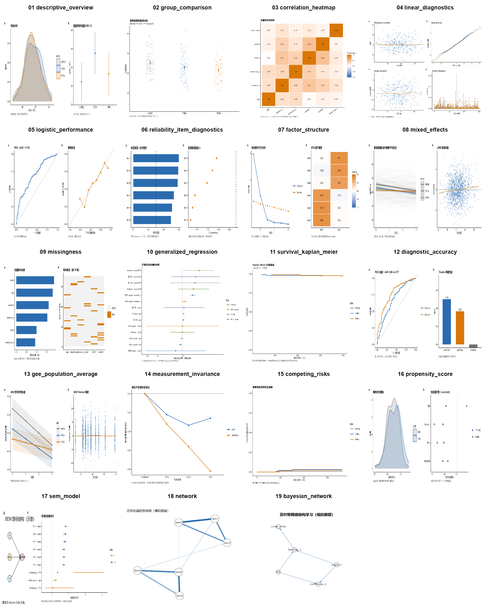

# 默认学术绘图模板：`medical-academic-v1`

`medical-academic-v1` 是 `medical-analysis-orchestrator` 的默认 R 绘图模板。它来自 v0.0.5 的 19 方法可视化回归测试，先作为稳定、克制、可审计的基础样式使用；新图形风格可以在后续版本中逐图替换或新增，不改变历史运行结果。

默认联系表：



## 视觉规范

- 统计计算、预览和正式导出全部由 R 完成；Python 不得重绘或重新计算。
- 默认字体优先 Arial；Windows 上如需中文，R 先选择可用的 CJK 字体并对 PNG/TIFF/SVG/PDF 使用同一设备字体。图形正文保持紧凑的 5–7 pt 论文级层级，避免装饰性标题和渐变背景。
- 使用白色背景、黑色坐标轴、无面板网格线和有限的蓝/橙/灰强调色；颜色不是唯一的信息编码方式。
- 优先使用 160–183 mm 的版心宽度；高度按证据角色和面板数量配置。
- `analysis` 档位默认输出 PNG；`manuscript` 档位输出 PNG、SVG、PDF、TIFF，PNG 至少 300 dpi，TIFF 默认 600 dpi，矢量文件保留可编辑文本。
- 每张图必须登记 `figure_id`、结论、证据角色、统计元数据、Source Data、源模块和输出哈希。
- 每次执行先生成图形计划，后写入视觉 QA：包括实际像素、DPI、导出格式和可选灰度复核副本。
- 图注应说明样本定义、中心统计量、区间或误差、检验、必要的多重比较校正和限制；无适用内容写明“不适用”。

## 候选图形族

| 方法 | 默认图形证据角色 |
|---|---|
| 描述性统计 | 分布形态与组别汇总区间 |
| 组间比较 | 原始个体、效应方向与不确定性 |
| 相关分析 | 对称色标的相关热图与有效样本量说明 |
| 线性回归 | 残差、正态性、异方差和影响观察诊断 |
| Logistic 回归 | ROC 与校准并列，避免只报告 AUC |
| 信度分析 | 条目贡献与删除条目敏感性，不自动删题 |
| EFA/CFA | 因子数证据与可解释载荷 |
| 混合效应模型 | 个体轨迹、群体拟合与残差审查 |
| 缺失数据 | 变量缺失比例与个体缺失模式 |
| 有序/多项/计数回归 | 指数化效应森林图，并区分不同 estimand |
| 生存分析 | Kaplan–Meier、删失和风险表 |
| 诊断准确性 | ROC、阈值性能和表观结果边界 |
| GEE | 群体平均预测与稳健区间 |
| 测量不变性 | 不同约束下 CFI/RMSEA 变化 |
| 竞争风险 | 竞争事件下的累积发生函数 |
| 倾向评分 | 共同支持、加权前后协变量平衡 |
| SEM | 理论路径结构与标准化参数不确定性 |
| 网络分析 | 探索性正则化偏相关与稳定性边界 |
| 贝叶斯网络 | 指定评分/搜索下的条件依赖结构，不作确定因果解释 |

## 配置与扩展

在 `reporting.figure_contract` 中设置：

```yaml
template: "medical-academic-v1"
profile: "analysis"       # 或 manuscript
backend: "R"
formats: ["png"]           # manuscript 至少 png/svg/pdf/tiff
width_mm: 183
height_mm: 120
dpi: 300
require_source_data: true
require_statistics_metadata: true
require_editable_text: false
```

用户可以覆盖版心尺寸、输出格式、分辨率和模板档位；若使用 `template: "custom"`，自定义 R 模块必须继续遵守 [R 图形证据契约](r-figure-contract.md)，并通过相同的输出验证。模板不会改变统计方法、模型参数或数据清洗规则。

`journal_profile` 仅提供保守的版式起点，不能替代目标期刊的最新版投稿要求；正式投稿前应按期刊作者指南复核图幅、字体、分辨率与格式。

## 解释边界

模板只规定图形的视觉和证据登记方式，不自动选择主要结局，不自动删除异常值，不把横断面关联、网络箭头或 SEM 路径写成确定因果关系，也不以显著性替代效应量、不确定性和研究设计说明。
